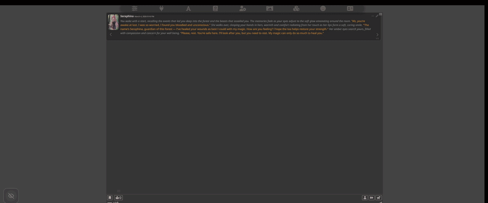

Add Videos(Audio viable) and images to your roleplay sessions. It cycles through the list of media you selected on your PC file explorer, can shuffle too. All stored locally on your specific browser, so follows session to session. Settings as well. Media Lists can be general, or character specific. Resize it to what you want etc. Background videos with music or sounds is nice for me specificly. 

If anyone wants to grab this and build over it or whatever go crazy. This is for my own use first and foremost, just figured I'd throw it on GitHub and share for anyone interested.

Any issues or bugs you see, I'll try to get at any really broken ones, no promises. Any features your thinking of, same thing. If I like it then I'll do it when I can. God speed.

# Media Cycler

A SillyTavern extension that cycles through background images and videos in its own window while you chat. Add a home list or per-character lists, control playback, and use movable or fullscreen modes.

## Tested / supported

**Tested on Windows 10/11 with Microsoft Edge and Firefox.** Other operating systems and browsers are untested.

## Features

- **Media cycling** – Automatically cycles through images and videos with fade transitions.
- **Character-specific lists** – Separate media lists per character with optional fallback to a home list when a character has no media.
- **File management** – Uses the browser file picker to choose files; selected media are stored as blobs in IndexedDB so they persist across sessions.
- **Playback controls** – Play/pause, next/previous, shuffle, volume, and “play video until end” option.
- **Audio** – Volume control and browser autoplay unlock (click once to enable sound).
- **UI modes** – Movable window, background/fullscreen mode, and minimal UI with show/hide controls.
- **Settings** – Image duration, video min/max duration (or play until end), character-specific mode, fallback to home list, and optional debug logging.
- **Storage** – IndexedDB for file blobs and metadata; storage capacity is monitored so you can see usage.

## Installation

**Option A – Install from SillyTavern:** In SillyTavern, open the Extensions panel and use the option to install an extension from a URL. Paste this repo’s GitHub link (e.g. `https://github.com/MongoBongo132/Media-Cycler`) and install. SillyTavern will download and place the extension for you.

**Option B – Manual install:** Copy the `Media-Cycler` folder into your SillyTavern extensions folder:
- `SillyTavern/data/default-user/extensions/Media-Cycler`

Ensure extensions are enabled in SillyTavern (if your setup requires it), then refresh. The extension will appear in the Extensions list and add its UI.

No npm or extra dependencies; the extension uses only SillyTavern’s bundled environment.

## Usage

- **Open the cycler** – Use the Media Cycler entry in the Extensions panel or the minimal UI (eye buttons) to show the media window and controls.
- **Add media** – Use “Add files” for the home list, or “Add for [Character]” when a character is loaded to build a character-specific list. The file picker lets you select one or more image/video files; they are stored in IndexedDB.
- **Settings** – Configure durations, “play until end,” character mode, and fallback in the extension’s in-UI settings. “Reset to Default” is available in the SillyTavern extension drawer under Media Cycler.
- **Modes** – Toggle movable mode to drag the window, or background mode for fullscreen media. Use “Hide Cycler” to collapse to the minimal UI.

## Known limitations

- **Browsers** – Media are stored in IndexedDB (So creates copies of the files and stored on your browser essentially).
- **Storage** – Large media libraries may hit browser storage limits; the extension reports capacity where possible.
- **Tested only on Windows with Edge and Firefox** – Other platforms and browsers will be unlikely tested on.
